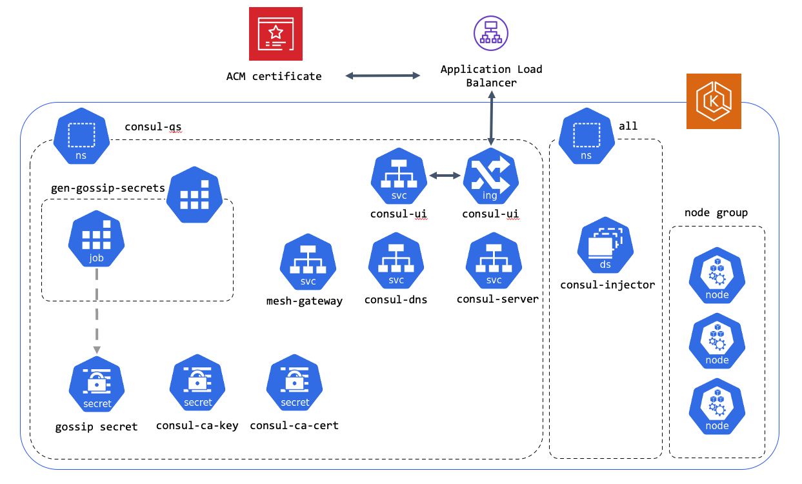
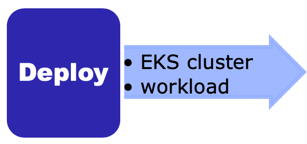

# HashiCorp Consul on Amazon EKS

**DEVELOPER PREVIEW** - This is a preview release and not intended for production use.

---

> This Quick Start was created by [HashiCorp](https://hashicorp.com) in collaboration with 
> Amazon Web Services (AWS). [AWS Quick Starts](https://aws.amazon.com) are automated 
> reference deployments that use AWS CloudFormation templates to deploy key technologies on AWS, following AWS best 
> practices. 

## Overview
This Quick Start helps you to deploy HashiCorp Consul servers and clients via Consul Helm chart on Amazon Elastic
 Kubernetes Service (Amazon EKS). HashiCorp Consul is a tool that provides the foundation of cloud networking automation
 using a central registry for service-based networking. Consul's core use cases include:
* Service registry & health monitoring, to provide a real-time directory of all services with their health status;
* Network middleware automation, with service discovery for dynamic reconfiguration as services scale up, down or move;
* Zero trust network with service mesh, to secure service-to-service traffic with identity-based security policies and
 encrypted traffic with Mutual-TLS.

HashiCorp Consul is designed for service networking professionals and application developers who want to securely connect
services, monitor, and automate them. It's deployed via [Consul Helm chart](https://github.com/hashicorp/consul-helm), 
which contains all of the resource definitions to install and configure Consul inside of a Kubernetes cluster.
Each stack in this deployment takes approximately 20 minutes to create.
For more information and step-by-step deployment instructions, see the [deployment guide](<https link to deployment guide>).

This Quick Start reference deployment guide provides step-by-step instructions for deploying HashiCorp Consul on Amazon EKS. 

> Please know that we may share who uses AWS Quick Starts with the AWS Partner Network (APN) Partner that collaborated 
> with AWS on the content of the Quick Start.

## Target Audience 

Service networking professionals and application developers who want to securely connect
services, monitor, and automate them on Amazon EKS.

## Architecture

Deploying this Quick Start with default parameters into an existing Amazon EKS cluster builds the following environment. 
For a diagram of the new VPC and new EKS cluster deployment options, see the 
[Amazon EKS Quick Start documentation](https://docs.aws.amazon.com/quickstart/latest/amazon-eks-architecture/architecture.html).
 

*Figure 1: Quick Start architecture for HashiCorp Consul on Amazon EKS*

As shown in Figure 1, the Quick Start sets up the following:
* In AWS:
  * Application Load Balancer.
  * Amazon Certificate Manager(ACM) certificate.
* In Kubernetes:
  * namespace for Consul.
  * Kubernetes secret containing gossip Consul integration ID and docker config json.
  * Consul services:
    * mesh-gateway
    * consul-server
    * consul-dns
    * consul-ui
  * Dedicated Consul server nodes.
  * ALB ingress controller.
  * Consul connect-injector.

## Cost and licenses

You are responsible for the cost of the AWS services used while running this Quick Start reference deployment. 
There is no additional cost for using the Quick Start.

The AWS CloudFormation template for this Quick Start includes configuration parameters that you can customize. 
Some of these settings may affect the cost of deployment. For cost estimates, see the pricing pages for each AWS 
service you will use. Prices are subject to change.

> Tip: We recommend that you enable the AWS Cost and Usage Report. This report delivers billing metrics to an Amazon 
> Simple Storage Service (Amazon S3) bucket in your account. It provides cost estimates based on usage throughout each 
> month and finalizes the data at the end of the month. For more information about the report, see the AWS 
> documentation.

## Planning the deployment

### Specialized knowledge

This Quick Start assumes familiarity with Amazon EKS, AWS CloudFormation and Kubernetes.

### AWS account

If you don’t already have an AWS account, create one at https://aws.amazon.com by following the on-screen instructions. 

### EKS cluster

If you are deploying onto an existing EKS cluster that was **not** created by the Amazon EKS Quick Start, you will need 
to configure the cluster to allow this Quick Start to manage your EKS cluster. The requirements are detailed in Step 2
of the *Deployment steps* section of this document.

	
## Deployment options

This Quick Start provides three deployment options:
* Deploy Consul into a new VPC (end-to-end deployment). This option builds a new AWS environment consisting of 
the VPC, subnets, NAT gateways, security groups, bastion hosts, EKS cluster, a node group, and other infrastructure 
components. It then deploys Consul into this new EKS cluster.
* Deploy Consul into a new EKS cluster in an existing VPC. This option builds a new AWS EKS cluster, a node 
group, and other infrastructure components into an existing VPC. It then deploys Consul into this new EKS cluster.
* Deploy Consul into an existing EKS cluster. This option provisions Consul in your existing AWS infrastructure.

## Deployment steps

### Step 1. Sign in to your AWS account

1. Sign in to your AWS account at https://aws.amazon.com with an IAM user role that has the necessary permissions. 
For details, see Planning the deployment earlier in this guide. 
2. Make sure that your AWS account is configured correctly, as discussed in the *Technical requirements* section.

### Step 2. Prepare existing EKS cluster

> Note: This step is only required if you are launching this Quick Start into an existing EKS cluster that was **not** 
> created using the Amazon EKS Quick Start. If you would like to create a new EKS cluster with your deployment, skip to 
> step 3.

1. Sign in to your AWS account, and launch the 
[cluster preparation template](https://us-east-1.console.aws.amazon.com/cloudformation/home?region=us-east-1#/stacks/create/template?stackName=Amazon-EKS&templateURL=https://s3.amazonaws.com/aws-quickstart/quickstart-amazon-eks/templates/amazon-eks-entrypoint-existing-cluster.template.yaml).
2.	The template is launched in the N. Virginia (us-east-1) AWS Region by default. To change the Region choose another Region 
from list in the upper-right corner of the navigation bar.
3. On the Create stack page, keep the default setting for the template URL, and then choose Next.
4. On the Specify stack details page, change the stack name if needed. Enter the name of the EKS cluster you would like 
to deploy to, as well as the Subnet ID's and security group ID associated with the cluster. These can be obtained from 
the EKS Cluster console.
5. On the options page, you can specify tags (key-value pairs) for resources in your stack and set advanced options. When you’re done, choose Next.
6. On the Review page, review and confirm the template settings. Under Capabilities, select the two check boxes to acknowledge that the template creates IAM resources and might require the ability to automatically expand macros.
7. Choose Create stack to deploy the stack.
8. Monitor the status of the stack until the status reaches CREATE_COMPLETE.
9. From the *Outputs* section of the stack, note the KubernetesRoleArn and the HelmRoleArn.
10. Add the roles to the aws-auth config map in your cluster, specifying *system:masters* for the groups, by following 
the steps in the [EKS documentation](). This allows the Quick Start to manage your cluster via AWS CloudFormation.

### Step 3. Launch the Quick Start

> Note: You are responsible for the cost of the AWS services used while running this Quick Start reference deployment. 
> There is no additional cost for using this Quick Start. For full details, see the pricing pages for each AWS service 
> used by this Quick Start. Prices are subject to change.

1. Sign in to your AWS account, and choose one of the following options to launch the AWS CloudFormation template. 
For help with choosing an option, see deployment options earlier in this guide.

|  |  |  |
| :---: | :---: | :---: |
| [Deploy into a new VPC and new EKS cluster](https://fwd.aws/V7d9d) | [Deploy into a new EKS cluster in an existing VPC](https://fwd.aws/98zVN) | [Deploy into an existing EKS cluster](https://fwd.aws/geqmr) |

Each new cluster deployments takes about 2 hours to complete. Existing cluster deployments take around 10 minutes.

2.	The template is launched in the N. Virginia (us-east-1) AWS Region by default. To change the Region choose another Region 
from list in the upper-right corner of the navigation bar.
3. On the Create stack page, keep the default setting for the template URL, and then choose Next.
4. On the Specify stack details page, change the stack name if needed. Review the parameters for the template, a 
reference is provided in the *Parameters* section of this document. Provide values for the parameters that require 
input. For all other parameters, review the default settings and customize them as necessary. When you finish reviewing 
and customizing the parameters, choose Next.
5. On the options page, you can specify tags (key-value pairs) for resources in your stack and set advanced options. 
When you’re done, choose Next.
6. On the Review page, review and confirm the template settings. Under Capabilities, select the two check boxes to 
acknowledge that the template creates IAM resources and might require the ability to automatically expand macros.
7. Choose Create stack to deploy the stack.
8. Monitor the status of the stack. When the status is CREATE_COMPLETE, the Consul cluster is ready.

### Step 4. Test the deployment
TODO: 

### Parameter reference
TODO: 

### Best practices for using Consul on AWS
TODO: 

## Security
TODO: 

## FAQ
**Q**. I encountered a CREATE_FAILED error when I launched the Quick Start. 

**A**. If AWS CloudFormation fails to create the stack, we recommend that you relaunch the template with Rollback on 
failure set to No. (This setting is under Advanced in the AWS CloudFormation console, Options page.) With this setting, 
the stack’s state is retained and the instance is left running, so you can troubleshoot the issue. 

> Important: When you set Rollback on failure to No, you continue to incur AWS charges for this stack. Please make sure 
> to delete the stack when you finish troubleshooting.

For general EKS troubleshooting steps see the 
[EKS Quick Start documentation](https://docs.aws.amazon.com/quickstart/latest/amazon-eks-architecture/). 

For Consul specific troubleshooting see 
[Consul troubleshooting documentation](https://learn.hashicorp.com/tutorials/consul/troubleshooting).

For additional information, see Troubleshooting AWS CloudFormation on the AWS website. 

## Send us feedback

To post feedback, submit feature ideas, or report bugs, use the 
[Issues](https://github.com/aws-quickstart/quickstart-eks-hashicorp-consul/issues) section of the GitHub repository for this Quick 
Start. If you’d like to submit code, please review the Quick Start Contributor’s Guide.

## Additional resources

### AWS resources

* [Getting Started Resource Center](https://aws.amazon.com/getting-started/)
* [AWS General Reference](https://docs.aws.amazon.com/general/latest/gr/)
* [AWS Glossary](https://docs.aws.amazon.com/general/latest/gr/glos-chap.html)

### AWS services

* [AWS CloudFormation](https://docs.aws.amazon.com/cloudformation/)
* [Amazon EKS](https://aws.amazon.com/eks/)
* [IAM](https://docs.aws.amazon.com/iam/)
* [Amazon VPC](https://docs.aws.amazon.com/vpc/)

### Consul documentation

* [Consul Kubernetes integration](https://www.consul.io/docs/k8s)

### Other Quick Start reference deployments

* [AWS Container Quick Start home page](https://aws.amazon.com/quickstart/?quickstart-all.sort-by=item.additionalFields.updateDate&quickstart-all.sort-order=desc&awsf.quickstart-homepage-filter=categories%23containers)
* [AWS Quick Start home page](https://aws.amazon.com/quickstart/)
